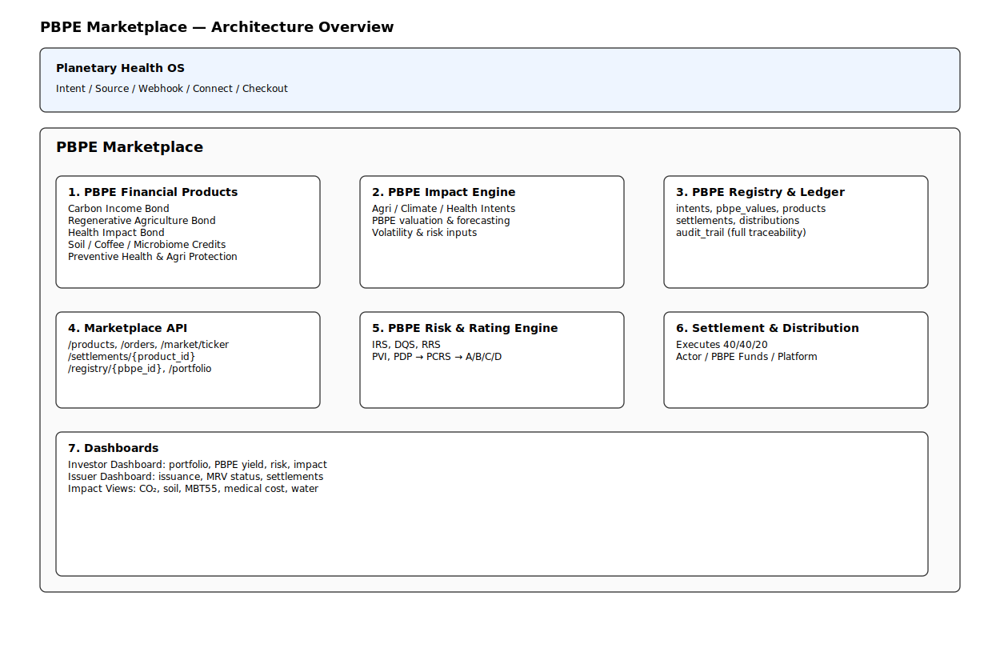

# **PBPE Marketplace**
### _The Financial Layer of the Planetary Bio‑Positive Operating System (PBPE‑OS)_

Transforming real-world climate, agriculture, biosecurity, and health impact  
into **standardized, investable, auditable financial value**.

PBPE Marketplace is Layer 4 of PBPE‑OS — the global operating system for planetary regeneration.

---

# 🚀 **Overview**

PBPE Marketplace converts real-world impact into **PBPE (Planetary Bio‑Positive Effect)**,  
a unified asset class backed by:

- CO₂ & GHG reduction  
- Soil carbon regeneration  
- Microbiome improvement (MBT55)  
- Food loss reduction  
- Quality enhancement  
- Biosecurity stabilization  
- Medical cost reduction  

PBPE Marketplace enables:

- Automated MRV  
- Transparent impact verification  
- Standardized PBPE financial products  
- Real-time settlement  
- Regenerative value distribution (40/40/20)  
- Scope 3 decarbonization through agricultural purchases  
- API‑based integration for enterprises, governments, and investors  

---

# 🌱 **Core Insight: Agricultural Products = Carbon Credits**

In PBPE‑OS:

> **Purchasing agricultural products is equivalent to purchasing carbon credits.**

Because MBT55 / AGRIX / PBPE Cycle generate:

- Waste-to-resource conversion  
- Up to **84% cost reduction**  
- Soil regeneration & humus formation  
- CO₂ sequestration & N₂O/CH₄ reduction  
- Higher yield & quality  
- Extended freshness → reduced food loss  
- Improved human health → reduced medical costs  

Therefore:

- Agricultural production **generates PBPE value**  
- PBPE is **traceable, auditable, monetizable**  
- Corporate buyers can count PBPE as **Scope 3 reduction**  

This is the foundation of PBPE Marketplace.

---

# 🧠 **How PBPE Marketplace Works**

```

Real-World Action (AGRIX / HealthBook / MBT55) ↓ ImpactIntent (PH‑API) ↓ PBPE Value Computed (Dashboard v3) ↓ PBPE Financial Products (Credits, Bonds, Insurance) ↓ Investors Allocate Capital ↓ Settlement & 40/40/20 Distribution

```

---

# 📦 **PBPE Financial Products**

Standardized under **PBPE‑FIN‑001**:

- PBPE Carbon Income Bonds  
- Regenerative Agriculture Bonds  
- Health Impact Bonds  
- Soil Carbon Credits  
- Coffee Resilience Credits  
- Microbiome Health Credits  
- Preventive Health Insurance  
- Agricultural Protection Products  

---

# 🧮 **PBPE Impact Engine (Layer 2 → Layer 3)**

Integrates:

- AGRIX soil MRV  
- MBT55 microbiome improvement  
- HealthBook medical cost reduction  
- PBPE climate value  
- Yield stability  
- Water efficiency  

Outputs a unified PBPE value per Intent.

---

# 📊 **PBPE Registry & Ledger**

Ensures:

- Unique PBPE issuance  
- Zero double-counting  
- Full traceability  
- Settlement records  
- Distribution records  
- Audit trails  

---

# 🧮 **PBPE Rating Engine**

Risk factors:

- Intent Reliability Score (IRS)  
- Data Quality Score (DQS)  
- Regional Risk Score (RRS)  
- PBPE Volatility Index (PVI)  
- PBPE Default Probability (PDP)  

Outputs: **PBPE‑A / PBPE‑B / PBPE‑C / PBPE‑D**

---

# 💸 **Settlement & Distribution (40/40/20)**

When PBPE is realized:

- **40%** → Actor (farmer, company, individual)  
- **40%** → PBPE / Climate / Health Funds  
- **20%** → Platform (BioNexus)  

A regenerative capital loop.

---

# 📈 **Dashboards (Layer 2 → Layer 4)**

### **Investor Dashboard**
- PBPE portfolio  
- Yield & risk  
- Impact metrics  
- ESG alignment  

### **Issuer Dashboard**
- Product issuance  
- MRV status  
- Settlement events  
- Impact reporting  

### **PBPE Dashboard v3 (Unified View)**
- Global KPIs  
- GHG breakdown  
- PBPE issuance  
- Value Flywheel  
- PBPE Credit Market  
- PBPE‑Backed Bonds  
- Enterprise Scope 3 metrics  

---

# 🧭 **PBPE‑OS Architecture (Layer 1–5)**

```

Layer 1: MBT‑Biosecurity‑Engine Layer 2: PBPE Dashboard (KPI Engine) Layer 3: PBPE Finance (Credits & Bonds) Layer 4: PBPE Marketplace (This Repository) Layer 5: PBPE Reporting (ESG & Scope 3)

```

Architecture diagram:  


---

# 🔧 **Repository Structure**

```

pbpe-marketplace/ │ ├── README.md ├── docs/ │ ├── credits/ │ │ └── PBPE_Credits_Specification.md │ ├── dashboard/ │ │ ├── PBPE_Dashboard_Architecture.md │ │ ├── PBPE_Dashboard_v3_UI_Mockup.md │ │ └── PBPE_Dashboard_v3_API_IO.md │ ├── finance/ │ │ └── PBPE_Backed_Bond_Specification.md │ └── architecture/ │ └── pbpe-architecture.svg │ ├── api/ │ └── openapi/ │ └── openapi.yaml ← PBPE‑Marketplace API (OpenAPI 3.1 v1.0) │ ├── backend/ │ ├── main.py │ ├── routers/ │ │ ├── dashboard.py │ │ ├── credits.py │ │ ├── impact.py │ │ ├── products.py │ │ ├── users.py │ │ └── bonds.py │ └── models/ │ ├── credits.py │ ├── impact.py │ ├── products.py │ ├── users.py │ └── bonds.py │ └── frontend/ └── (Dashboard v3 implementation)

```

---

# 📘 **API Specification (OpenAPI 3.1)**

Full API spec:  
```

api/openapi/openapi.yaml

```

Includes:

- Dashboard API  
- Credits API  
- Impact API  
- Finance (PBPE‑Backed Bonds)  
- Products API  
- Users API  

---

# 🌍 **Vision**

PBPE Marketplace establishes **planetary value as a global asset class**,  
creating a financial system where:

- Soil regeneration  
- CO₂ reduction  
- Microbiome improvement  
- Medical cost reduction  
- Waste-to-resource cycles  

are not externalities,  
but **primary sources of economic value**.

PBPE Marketplace is the economic engine of PBPE‑OS.

