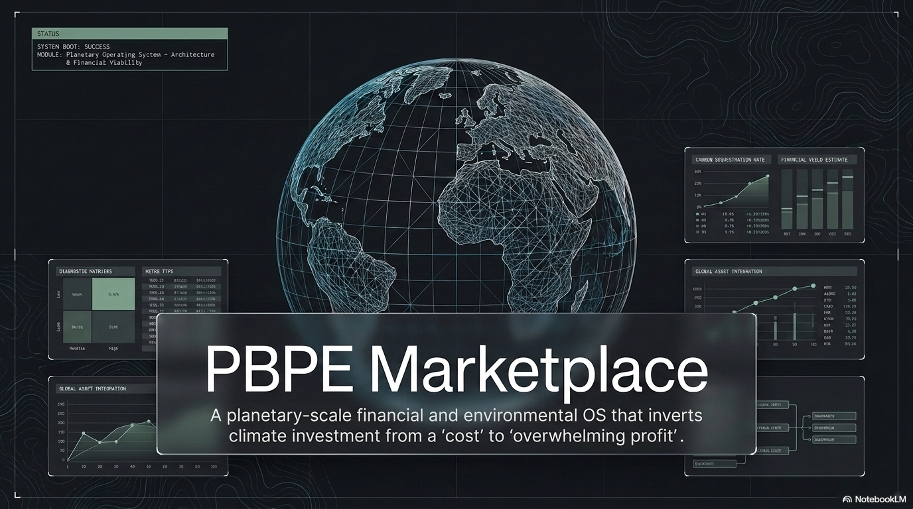
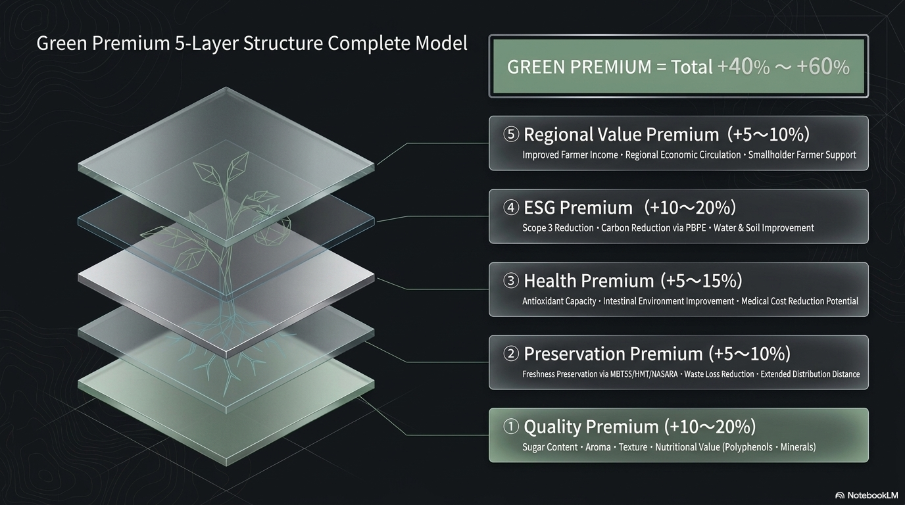
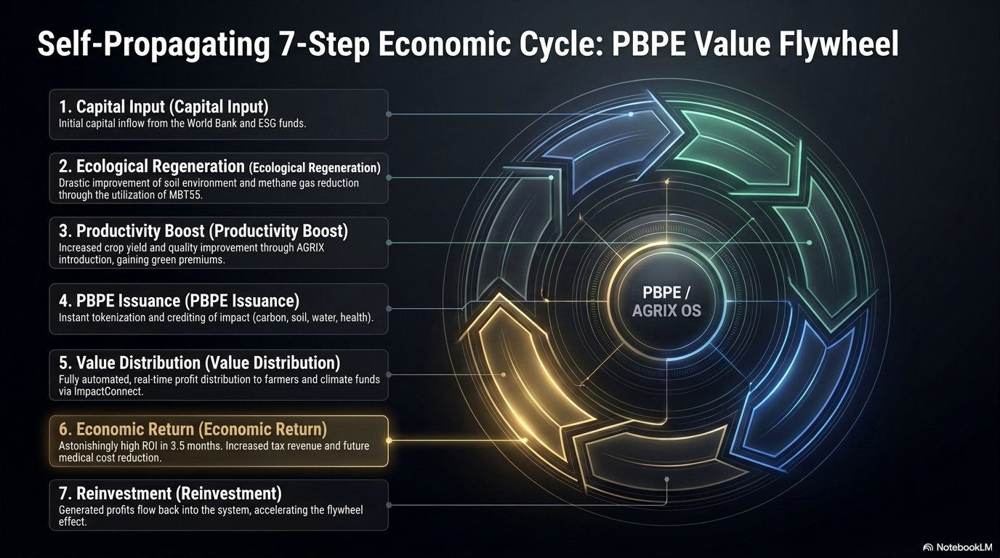
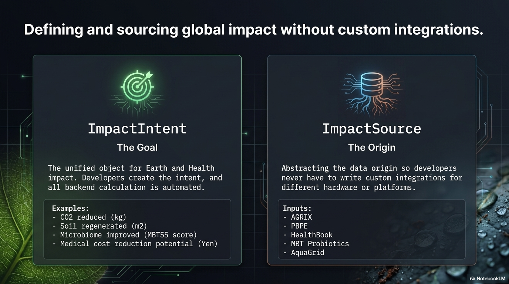

# 🌍 PBPE Marketplace  
### *地球・農業・気候・健康のためのオペレーティングシステム*



**ROI 344%｜投資回収3.5ヶ月｜GHG削減510 MtCO₂e｜グリーンプレミアム +40〜60%**

---

# 📊 ダッシュボード

### **PBPE KPIs Dashboard**  
https://pbpe-marketplace.vercel.app/dashboard/kpis

### **PBPE Registry Dashboard**  
https://pbpe-marketplace.vercel.app/dashboard/registry

PBPEの価値・発行・レジストリをリアルタイムで確認できます。

---

# 🔢 PBPE‑UID（7桁コード）

PBPE‑UID は地球価値のためのグローバルアドレスシステムです。

```

例：PBPE‑UID Code
AAA‑1234

```

- AAA：資産タイプ  
- 1234：Base36  

### **役割**
- 二重計上ゼロ  
- AIエージェントが直接アクセス  
- 企業・政府・金融機関が統合利用  
- PBPE市場の流動性向上  

---

# 🌐 PBPE‑UIDの社会的インパクト

### ✔ 農業所得の向上  
### ✔ 気候変動ファイナンスの透明化  
### ✔ 医療費削減の金融資産化  
### ✔ AIエージェントによる自律経済  

---

# 💱 グリーンプレミアム



---

# 🔄 PBPE Value Flywheel



---

# 🧠 Impact Engine（PH‑API）



---

# 💼 PBPE金融商品

- PBPEクレジット  
- PBPEボンド  
- PBPE保険  
- PBPE気候ファンド  

---

# 🧭 PBPE‑OSアーキテクチャ

```

Layer 1: MBT‑Biosecurity‑Engine Layer 2: PBPE Dashboard Layer 3: PBPE Finance Layer 4: PBPE Marketplace Layer 5: PBPE Reporting

コード

```

---

# 🌍 ビジョン

PBPE Marketplaceは、  
**地球価値を経済価値に変換する世界初のOS**です。
